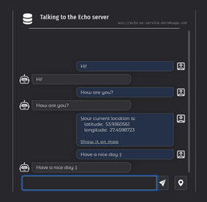

# EchoChat

Link: [baradzenka.github.io/EchoChat](https://baradzenka.github.io/EchoChat/)

Communication with echo server on the Internet. You send a message and it returns it back to you. You can also find out your location.

HTML + CSS + JavaScript are used.